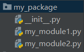

Python

## 字符串格式化

1. 通过占位的形式，完成数字与字符串的拼接

| 格式符号 | 转化                             |
| -------- | -------------------------------- |
| %s       | 将内容转换成字符串，放入占位位置 |
| %d       | 将内容转换成整数，放入占位位置   |
| %f       | 将内容转换成浮点型，放入占位位置 |

可借助"m.n" 来控制数据的宽度和精度

m,控制宽度，要求是数字，设置的宽度小于数字自身

.n,控制小数点精度，要求是数字，会进行小数的四舍五入

示例：

%5d：表示将整数的宽度控制在5位 示例11 变成(三个空格加11)

%5.2f:表示将宽度控制为5，将小数点精度设置为2

%.2f:只设置小数点的宽度为2

```python
# 通过占位的形式，完成数字与字符串的拼接
name = "百年孤独"
num = 1
price = 39.9
message ="我买了%d本,%s的书，价格是：%2.1f" %(num, name, price)
print(message)
# 输出的结果为：我买了1本,百年孤独的书，价格是：39.9
```

2. 通过 f" 内容{变量}" 的格式来快速格式化

```python
name = "百年孤独"
num = 1
price = 39.9
message =f"我买了{num}本,{name}的书，价格是：{price}"
print(message)
# 输出的结果为：我买了1本,百年孤独的书，价格是：39.9
```

3. 布尔类型

```python
# 布尔类型
bool_1 = True
print(f"bool_1变量的内容是：{bool_1},类型是{type(bool_1)}")
# 结果为
bool_1变量的内容是：True,类型是<class 'bool'>
```

4. input ()语句，能从键盘输入数据

   可以使用：input(提示信息)，用以在使用输入内容之前显示提示信息

   获取到的数据永远都是字符串类型

```python
# input 语句
str_ = input("你今天学习了吗！")
print("奥，你今天%s" % str_)
# 输入数字类型
num = input ("你今天完成了几项任务：")
num = int(num)
print("你今天完成的任务有：", type(num))

"""
结果：你今天学习了吗！学习了
奥，你今天学习了
你今天完成了几项任务：3
你今天完成的任务有： <class 'int'>
"""
```

5. if-else语句

```python
# if else语句
height = int(input("请输入你的身高："))
if height > 120:
    print("你需要购买门票，10元")
else:
    print("你不需要购买门票，可以免费游玩")
print("祝您玩的愉快！")
    
```

6. if-elif-else语句

```python
# if-elif-else语句
if int(input("请输入您的身高：")) < 120:
    print("你可以免费游玩")
elif int(input("您的VIP等级是（1-5）：")) > 3:
    print("您可以免费游玩")
elif int(input("今天是几号：")) == 1:
    print("今天是1号，可以免费游玩")
else:
    print("您需要买票才能游玩")
    
```

7. 设置随机数字

```python
import random
num = random.randint(1,100)
print(num)
```

8. print语句中，加上end=' ' 即可输出不换行了

```python
print("Hello", end='')
print("World", end='')
# 输出的结果为：HelloWorld

# tab键
print("Hello\tWorld")
# 输出的结果为：
Hello	World
```

9. 九九乘法表

   ```python
   i=1
   while i <=9:
       j=1
       while j<=i:
           print(f"{j}*{i}={j*i}\t",end='')
           j +=1
       i +=1
       print()
   """
   结果为：
   1*1=1	
   1*2=2	2*2=4	
   1*3=3	2*3=6	3*3=9	
   1*4=4	2*4=8	3*4=12	4*4=16	
   1*5=5	2*5=10	3*5=15	4*5=20	5*5=25	
   1*6=6	2*6=12	3*6=18	4*6=24	5*6=30	6*6=36	
   1*7=7	2*7=14	3*7=21	4*7=28	5*7=35	6*7=42	7*7=49	
   1*8=8	2*8=16	3*8=24	4*8=32	5*8=40	6*8=48	7*8=56	8*8=64	
   1*9=9	2*9=18	3*9=27	4*9=36	5*9=45	6*9=54	7*9=63	8*9=72	9*9=81	
   """
   ```
   
   10. range语句的功能是：
   
   获得一个数字序列
   
   range语句的语法格式
   
   语法1：range(num)
   
   语法2：range(num1,num2)
   
   语法3：range(num1,num2,step)
   
   range语句的注意事项：
   
   * 语法1从0开始，到num结束(不含num本身)
   * 语法2从num1开始，到num2结束（不含num2本身）
   * 语法3从num1开始，到num2结束（不含num2本身),步长以step值为准

###  continue与break

1. continue的作用是：

中断所在循环的当次执行，直接进入下一次

2. break的作用是：

直接结束所在的循环

3. 注意事项：

•continue和break，在for和while循环中作用一致

•在嵌套循环中，只能作用在所在的循环上，无法对上层循环起作用

案例：

某公司，账户余额有1W元，给20名员工发工资。

•员工编号从1到20，从编号1开始，依次领取工资，每人可领取1000元

•领工资时，财务判断员工的绩效分（1-10）（随机生成），如果低于5，不发工资，换下一位

•如果工资发完了，结束发工资。

•continue用于跳过员工，break直接结束发工资

if判断余额，不要忘记发完工资后，余额减少1000哦

```python
money = 10000
for i in range(1, 21):
    import random
    score = random.randint(1,10)
    if score < 5:
        print(f"员工{i}，绩效分{score}，低于5，不发工资，下一位。")
        continue
    else:
        money -= 1000
        print (f"向员工{i}发放工资1000元，账户余额还剩{money}元")
        if money == 0:
            print("工资发完了，下个月来吧")
            break

```

## 函数

1. 函数的定义

```python
def 函数名(传入参数):
    函数体
    return 返回值
```

2. 函数使用步骤:

* 先定义函数

* 后调用函数

3. 注意事项：

* 参数不需要，可以省略

* 返回值不需要，可以省略

***

### None类型

Python中有一个特殊的字面量：None，其类型是：<class 'NoneType'>

无返回值的函数，实际上就是返回了：None这个字面量

None作为一个特殊的字面量，用于表示：空、无意义，其有非常多的应用场景。

* 用在函数无返回值上

* 用在if判断上

* 在if判断中，None等同于False

* 一般用于在函数中主动返回None，配合if判断做相关处理

* 用于声明无内容的变量上

* 定义变量，但暂时不需要变量有具体值，可以用None来代替

***

### 函数的说明文档

函数是纯代码语言，想要理解其含义，就需要一行行的去阅读理解代码，效率比较低。

我们可以给函数添加说明文档，辅助理解函数的作用。

语法如下：

```python
def add(x, y):
    """
    函数说明
    :param x: 形参x的说明
    :param y: 形参y的说明
    :return: 返回值的说明
    """
   	# 函数体
    return # 返回值

```


通过多行注释的形式，对函数进行说明解释

* 内容应写在函数体之前

* 在PyCharm编写代码时，可以通过鼠标悬停，查看调用函数的说明文档

***

### 局部变量

所谓局部变量是定义在函数体内部的变量，即只在函数体内部生效

局部变量的作用：在函数体内部，临时保存数据，即当函数调用完成后，则销毁局部变量


### 全局变量

所谓全局变量，指的是在函数体内、外都能生效的变量


### global

使用 global关键字 可以在函数内部声明变量为全局变量, 如下所示

```python
# global关键字，在函数内声明变量为全局变量
num = 200

def test_a():
    print(f"test_a:{num}")

def test_b():
    global num
    num = 500
    print(f"test_b:{num}")

test_a()
test_b()
print(num)

"""
结果为：
test_a:200
test_b:500
500
"""
```

***

### 函数多种传参方式

#### 位置参数

**位置参数：**调用函数时根据函数定义的参数位置来传递参数

注意：

   传递的参数和定义的参数的顺序及个数必须一致

```python
def user_info(name, age, gender):
    print(f"姓名是:{name}, 年龄是:{age}, 性别是:{gender}")
# 位置参数 - 默认使用形式
user_info('小明', 20, '男')
```

***

#### 关键字参数

**关键字参数：**函数调用时通过“键=值”形式传递参数.

**作用**： 可以让函数更加清晰、容易使用，同时也清除了参数的顺序需求.

注意：

​    函数调用时，如果有位置参数时，位置参数必须在关键字参数的前面，但关键字参数之间不存在先后顺序

```python
def user_info(name, age, gender):
    print(f"姓名是:{name}, 年龄是:{age}, 性别是:{gender}")
    
user_info(name='小王', age=11, gender='女')
user_info(age=10, gender='女', name='潇潇')    # 可以不按照参数的定义顺序传参
    
```

***

#### 缺省参数

**缺省参数：**缺省参数也叫默认参数，用于定义函数，为参数提供默认值，调用函数时可不传该默认参数的值（注意：所有位置参数必须出现在默认参数前，包括函数定义和调用）.

**作用**:当调用函数时没有传递参数, 就会使用默认是用缺省参数对应的值.

注意：

​    函数调用时，如果为缺省参数传值则修改默认参数值, 否则使用这个默认值

```python
# 缺省参数（默认值）
def user_info(name, age, gender):
    print(f"姓名是:{name}, 年龄是:{age}, 性别是:{gender}")

user_info('小天', 13, '男')
```

***

####  不定长参数

**不定长参数：**不定长参数也叫可变参数. 用于不确定调用的时候会传递多少个参数(不传参也可以)的场景.

**作用** 当调用函数时不确定参数个数时, 可以使用不定长参数

**不定长参数的类型**

   ①位置传递

   ②关键字传递


1. 位置传递
   传进的所有参数都会被args变量收集，它会根据传进参数的位置合并为一个元组(tuple)，args是元组类型，这就是位置传递

```python
# 不定长 - 位置不定长, *号
# 不定长定义的形式参数会作为元组存在，接收不定长数量的参数传入
def user_info(*args):
    print(f"args参数的类型是：{type(args)}，内容是:{args}")  

user_info(1, 2, 3, '小明', '男孩')
# type(args)的类型为tuple
```

2. 关键字传递

   注意：

      参数是“键=值”形式的形式的情况下, 所有的“键=值”都会被kwargs接受, 同时会根据“键=值”组成字典.

   ```python
   # 不定长 - 关键字不定长, **号
   def user_info(**kwargs):
       print(f"args参数的类型是：{type(kwargs)}，内容是:{kwargs}")
   user_info(name='小王', age=11, gender='男孩')
   # type(kwargs)的类型为：dict
   ```

#### lambda匿名函数函数的定义中

* def关键字，可以定义带有名称的函数
* lambda关键字，可以定义匿名函数（无名称）
* 有名称的函数，可以基于名称重复使用。
  无名称的匿名函数，只可临时使用一次。
  匿名函数定义语法：
* lambda 是关键字，表示定义匿名函数
* 传入参数表示匿名函数的形式参数，如：x, y 表示接收2个形式参数
* 函数体，就是函数的执行逻辑，要注意：只能写一行，无法写多行代码
***
## 数据容器
Python中的数据容器：
一种可以容纳多份数据的数据类型，容纳的每一份数据称之为1个元素
每一个元素，可以是任意类型的数据，如字符串、数字、布尔等。
数据容器根据特点的不同，如：
* 是否支持重复元素
* 是否可以修改
* 是否有序，等
分为5类，分别是：
列表（list）、元组（tuple）、字符串（str）、集合（set）、字典（dict）
***
### list(列表)

1. 列表的定义

基本语法：

注意：列表可以一次存储多个数据，且可以为不同的数据类型，支持嵌套

```python
"""
字面量
[元素1,元素2,元素3]

定义变量
变量名称 = [元素1,元素2,元素3]

定义空列表
变量名称 = []
变量名称 = list()
"""
```

```python
# 定义一个列表list
my_list = ["hello", "study", "python"]
print(my_list)
print(type(my_list))

my_list = ["cute",19, True]
print(my_list)
print(type(my_list))

# 定义一个嵌套的列表
my_list = [[1, 5, 98], True, "python"]
print(my_list)
print(type(my_list))

# 通过下标索引取出对应位置的数据
my_list = ["fairy", "Tom", "python"]
# 列表[下标索引]，从前向后从0开始，每次+1 从后向前从-1开始，每次-1
print(my_list[0])
print(my_list[1])
print(my_list[2])
# 错误示范：通过下标索引取出数据，一定不要超出范围
# print(my_list[3])

# 通过索引取出数据（倒叙取出）
print(my_list[-1])
print(my_list[-2])
print(my_list[-3])

# 取出嵌套列表的元素
my_list = [[1, 2, 3],[4, 5, 6]]
print(my_list[1][2])

```


***
2. 列表的下标(索引)
列表的每一个元素，都有编号称之为下标索引
从前向后的方向，编号从0开始递增
从后向前的方向，编号从-1开始递减


如果列表是嵌套的列表，同样支持下标索引


3. 列表的常用操作(方法)

   函数是一个封装的代码单元，可以提供特定功能。

   在Python中，如果将函数定义为class（类）的成员，那么函数会称之为：方法

   
   
   方法和函数功能一样， 有传入参数，有返回值，只是方法的使用格式不同：

   函数的使用：

   方法的使用：
   

方法：
| 方法                    | 作用                                           |
| ----------------------- | ---------------------------------------------- |
| 列表.append(元素)       | 向列表中追加一个元素                           |
| 列表.extend(容器)       | 将数据容器的内容依次去除，追加到列表尾部       |
| 列表.insert[下标，元素] | 在指定下标出，插入指定的元素                   |
| del 列表[下标]          | 删除列表指定下标元素                           |
| 列表.pop(下标)          | 删除列表指定下标元素                           |
| 列表.remove(元素)       | 从前向后，删除次此列表第一个匹配项             |
| 列表.clear()            | 清空列表                                       |
| 列表.count(元素)        | 统计此元素在列表中出现的次数                   |
| 列表.index(元素)        | 查找指定元素在列表的下标，找不到报错ValueError |
| len(列表)               | 统计容器内有多少元素                           |

特点：
* 可以容纳多个元素（上限为2**63-1、9223372036854775807个）

* 可以容纳不同类型的元素（混装）

* 数据是有序存储的（有下标序号）

* 允许重复数据存在

* 可以修改（增加或删除元素等）

```python
# list列表的常用操作
my_list = ["fairy", "study", "python"]
# 1.1 查找某元素在列表内的下标索引
index = my_list.index("python")
print(f"python在列表中的下边索引值是：{index}")
# 1.2 如果被查找的元素不存在，会报错
# index = my_list("hello")
# print(f"hello在列表中的下标索引值是：{index}")

# 2. 修改特定下标索引的值
my_list[0] = "一起来学习python吧！！！"
print(f"列表被修改元素值后，结果是：{my_list}")
# 3.在指定下标位置插入新元素
my_list.insert(1, "good")
print(f"列表插入元素后，结果是：{my_list}")
# 4.在列表的尾部追加```单个```新元素
my_list.append("坚持下去！！！")
print(f"列表追加一个新元素后，结果是：{my_list}")
# 5.在列表的尾部追加```一批```新元素
my_list1 = [1, 2, 3]
my_list.extend(my_list1)
print(f"列表在追加了一批新的列表后，结果是：{my_list}")
# 6.1 方式1：del 列表[下标]
del my_list[2]
print(f"列表删除元素后结果是：{my_list}")
# 6.2 方式2：列表.pop(下标）
my_list = ["fairy", "study", "python"]
element = my_list.pop(2)
print(f"通过pop方式取出元素后列表内容：{my_list},取出的元素是：{element}")
# 7.删除某元素在列表中的第一个匹配项
my_list = ["fairy", "study", "fairy", "study", "python"]
my_list.remove("study")
print(f"通过remove方法移除元素后，列表的结果是：{my_list}")
# 8.清空列表
my_list.clear()
print(f"列表被清空，结果是：{my_list}")
# 9.统计列表内某元素的数量
my_list = ["fairy", "study", "python", "study", "fairy"]
count = my_list.count("fairy")
print(f"列表中fairy的数量是：{count}")
# 10. 统计列表中全部的元素数量
my_list = ["fairy", "study", "python", "study", "fairy"]
count = len(my_list)
print(f"列表的元素数量总共有：{count}")

```
遍历
```python
# 使用while和for循环遍历列表
def list_while_func():
    """
    使用while循环遍历列表
    :return:
    """
    mylist = ["fairy", "good", "study", "python"]
    # 循环控制变量：通过下标索引来控制，默认是0
    # 每一次循环，将下标索引变量+1
    # 循环条件：下标索引变量 < 列表的元素数量

    # 定义一个标量，用来标记列表的下标
    index = 0   # 初始下标为0
    while index < len(mylist):
        element = mylist[index]
        print(f"列表的元素：{element}")
        # 将循环变量（index）每一次循环都+1
        index += 1
if __name__ == '__main__':
    list_while_func()

def list_for_func():
    """
    使用for循环遍历列表
    :return:
    """
    mylist = [1, 2, 4, 6, 7]
    for element in mylist:
        print(f"列表的元素有：{element}")

if __name__ == '__main__':
    list_for_func()
```
***

### tuple(元组)

元组定义：定义元组使用小括号，且使用逗号隔开各个数据，数据可以是不同的数据类型。

注意：元组只有一个数据，这个数据后面要添加逗号

元组也支持嵌套：

方法：

| 方法      | 作用                                               |
| --------- | -------------------------------------------------- |
| index()   | 查看某个数据，如果数据存在返回对应的下标，否则报错 |
| count()   | 统计某个数据在当前元组出现的次数                   |
| len(元组) | 统计元组内的元素的个数                             |


特点：
 * 可以容纳多个数据
 * 可以容纳不同类型的数据（混装）
 * 数据是有序存储的（下标索引）
 * 允许重复数据存在
 * 不可以修改（增加或删除元素等）
 * 支持for循环

多数特性和list一致，不同点在于不可修改的特性。
```python
# 定义元组
t1 = (1, 2, 3, 5, 6, 8, 10)
t2 = ()
t3 =tuple()
print(f"t1的类型是：{type(t1)},内容是：{t1}")
print(f"t2的类型是：{type(t2)},内容是：{t2}")
print(f"t3的类型是：{type(t3)},内容是：{t3}")

# 定义单个元素的元组
t4 = ("hell", )
print(f"t4的类型是：{type(t4)},内容是：{t4}")
# 元组的嵌套
t5 = ((1, 2, 4,), (3, 6, 9))
print(f"t5的类型是：{type(t5)},内容是：{t5}")

# 下标索引去取出内容
num = t5[1][2]
print(f"从嵌套元组中取出的数据是：{num}")

# 元组的操作：index查找方法
t6 = ("fairy", "good", "study", "python")
index = t6.index("good")
print(f"在元组t6中查找good的是：下标{index}")

# 元组的操作：count统计方法
t7 = ("fairy", "good", "study", "python", "fairy")
num = t7.count("fairy")
print(f"在元组t7中统计fairy的数量有：{num}")

# 元组的操作：len函数统计元组元素数量
t8 = ("fairy", "good", "study", "python", "fairy")
num = len(t8)
print(f"t8元组中的元素有：{num}")

# 元组的遍历：while
index = 0
while index < len(t8):
    print(f"元组的元素有：{t8[index]}")
    index += 1

# 元组的遍历：for
for element in t8:
    print(f"t8元组中的元素有：{element}")

```
***
### str(字符串)

方法：

| 方法                                | 作用                                                         |
| ----------------------------------- | ------------------------------------------------------------ |
| 字符串[下标]                        | 根据下标索引取出特定位置字符                                 |
| 字符串.index(字符串)                | 查找给定字符的第一个匹配项的下标                             |
| 字符串.replace(字符串1，字符串2)    | 将字符串内的全部字符串1，替换为字符串2 ，不会修改原字符串，而是得到一个新的字符串 |
| 字符串.split(字符串)                | 按照给定字符串，对字符串进行分隔，不会修改原字符串，而是得到一个新的列表 |
| 字符串.strip()/字符串.strip(字符串) | 移除首尾的空格和换行符或指定字符串                           |
| 字符串.count(字符串)                | 统计字符串内某字符串的出现次数                               |
| len(字符串)                         | 统计字符串的字符个数                                         |


特点：
* 只可以存储字符串

* 长度任意（取决于内存大小）

* 支持下标索引

* 允许重复字符串存在

* 不可以修改（增加或删除元素等）
  支持for循环
  基本和列表、元组相同
  不同与列表和元组的在于：字符串容器可以容纳的类型是单一的，只能是字符串类型。
  不同于列表，相同于元组的在于：字符串不可修改，得到的是新字符串
  ```python
  my_str = "Life is not only about the present,but"
  # 通过下标索引取值
  value = my_str[2]
  value1 = my_str[-16]
  print(f"从字符串{my_str}取下标为2的元素，值为：{value}，取下标为-16的元素，值为：{value1}")
  
  # index方法
  value = my_str.index("only")
  print(f"字符串{my_str}中查找only，其起始下标为：{value}")
  
  # replace方法
  new_my_str = my_str.replace("not","")
  print(f"将字符串{my_str},进行替换后得到：{new_my_str}")
  
  # split方法
  my_str = "hello ,we are togrther study python"
  my_str_list = my_str.split(" ")
  print(f"将字符串{my_str}进行split切分后得到：{my_str_list}，类型是{type(my_str_list)}")
  
  # strip方法
  my_str = " hello ,we are togrther study python "
  new_my_str = my_str.strip() #不传入参数，去除首尾空格
  print(f"字符串{my_str}进行strip()后，结果为：{new_my_str}")
  
  my_str = "12hello ,we are togrther study python21"
  new_my_str = my_str.strip("12")
  print(f"字符串{my_str}进行strip(12)后，结果为：{new_my_str}")
  
  # 统计字符串中某字符串的出现的次数count
  my_str = "hello ,we are togrther study python"
  count = my_str.count("e")
  print(f"字符串{my_str}中e出现的次数是：{count}")
  
  # 统计字符串的长度 ,len()
  num =len(my_str)
  print(f"字符串{my_str}的长度是：{num}")
  ```

***
### 序列切片
序列是指：内容连续、有序，可使用下标索引的一类数据容器
列表、元组、字符串，均可以可以视为序列。
序列支持切片，即：列表、元组、字符串，均支持进行切片操作
切片：从一个序列中，取出一个子序列
语法：序列[起始下标:结束下标:步长]
表示从序列中，从指定位置开始，依次取出元素，到指定位置结束，得到一个新序列：
* 起始下标表示从何处开始，可以留空，留空视作从头开始
* 结束下标（不含）表示何处结束，可以留空，留空视作截取到结尾
* 步长表示，依次取元素的间隔
* **步长留空，留空表示步长为1**
* **步长1表示，一个个取元素**
* **步长2表示，每次跳过1个元素取**
* **步长N表示，每次跳过N-1个元素取**
* **步长为负数表示，反向取（注意，起始下标和结束下标也要反向标记）**
注意，此操作不会影响序列本身，而是会得到一个新的序列（列表、元组、字符串）
```python
# list进行切片，从1开始，4结束，步长为1
my_list = [0, 1, 2, 3, 4, 5, 6, 7]
result1 = my_list[1:4]  # 步长默认是1，所以可以省略不写
print(f"结果为：{result1}")

# 对tuple进行切片，从头开始，到最后结束，步长为1
my_tuple = (0, 1, 2, 3, 4, 5, 6)
result = my_tuple[:] #起始和结束不写表示从头到尾，步长为1可以省略
print(f"结果为：{result}")

# 对str进行切片，从头开始，到最后结束，步长为2
my_str = "0123456"
result = my_str[::2]
print(f"结果为：{result}")

# 对str进行切片，从头开始，到最后结束，步长为-1
my_str = "0123456789"
result = my_str[::-1]   #等同于将序列进行反转
print(f"结果为：{result}")
```
***

### set(集合)

集合，最主要的特点就是：不支持元素的重复（自带去重功能）、并且内容无序，因为集合是无序的，所以集合不支持：下标索引访问

方法：

| 方法                           | 作用                                                        |
| ------------------------------ | ----------------------------------------------------------- |
| 集合.add(元素)                 | 集合内添加一个元素                                          |
| 集合.remove(元素)              | 移除集合内指定的元素                                        |
| 集合.pop()                     | 从集合中随机取出一个元素                                    |
| 集合.clear()                   | 将集合清空                                                  |
| 集合1.difference(集合2)        | 得到一个新集合，内含2个集合的差集，原有的2个集合内容不变    |
| 集合1.difference_update(集合2) | 在集合1中，删除集合2中存在的元素，集合1被修改，集合2不变    |
| 集合1.union(集合2)             | 得到1个新集合，内含2个集合的全部元素，原有的2个集合内容不变 |
| len(集合)                      | 得到一个整数，记录了集合的元素数量                          |


特点：
* 可以容纳多个数据
* 可以容纳不同类型的数据（混装）
* 数据是无序存储的（不支持下标索引）
* 不允许重复数据存在
* 可以修改（增加或删除元素等）
* 支持for循环
```python
# 定义集合
my_set = {"fairy", "study", "python", "fairy", "study"}
my_set_empty = set() # 定义空集合
print(f"my_set的内容是：{my_set},类型是：{type(my_set)}")
print(f"my_set的内容是：{my_set_empty},类型是：{type(my_set_empty)}")

# 添加新元素
my_set.add("begin")
print(f"my_set添加元素后结果是：{my_set}")

# 移除元素
my_set.remove("begin")
print(f"my_set移除begin后，结果是：{my_set}")

# 随机取出一个元素
element = my_set.pop()
print(f"集合被取出元素是：{element}，取出元素后：{my_set}")

# 清空集合，clear()
my_set.clear()
print(f"集合被清空啦，结果是：{my_set}")

# 取2个集合的差集
set1 = {1, 2, 3}
set2 = {1, 5, 6}
set3 = set1.difference(set2)
print(f"取出差集后的结果是：{set3}")
print(f"取出差集后，原有set1的内容：{set1}")
print(f"取出差集后，原有set2的内容：{set2}")
"""
结果为
取出差集后的结果是：{2, 3}
取出差集后，原有set1的内容：{1, 2, 3}
取出差集后，原有set2的内容：{1, 5, 6}

"""

# 消除2个集合的差集
set1 = {1, 2, 3}
set2 = {1, 5, 6}
set1.difference_update(set2)
print(f"消除差集后，原有set1的内容：{set1}")
print(f"消除差集后，原有set2的内容：{set2}")
"""
结果为
消除差集后，原有set1的内容：{2, 3}
消除差集后，原有set2的内容：{1, 5, 6}

"""

# 2个集合合并为1个
set1 = {1, 2, 3}
set2 = {1, 5, 6}
set3 = set1.union(set2)
print(f"2集合合并结果：{set3}")
print(f"合并后集合1:{set1}")
print(f"合并后集合2：{set2}")

# 统计集合元素数量len()
set1 = {1, 2, 3, 4, 5, 6, 7, 8}
num = len(set1)
print(f"集合内的元素数量哟：{num}个")

# 集合的遍历
# 集合不支持下标索引，不能用while循环
# 可以用for循环
set1 = {1, 2, 3, 4, 5}
for element in set1:
    print(f"集合的元素有：{element}")
```
***

### dict(字典、映射)
* 可以容纳多个数据

* 可以容纳不同类型的数据（混装）

* 数据是无序存储的（不支持下标索引）

* 不允许重复数据存在

* 可以修改（增加或删除元素等）

* 支持for循环
  方法：

  | 方法 | 作用 |
  | ---- | ---- |
  | 字典[Key] | 获取制定Key |
  | 字典[Key]=Value | 添加或更新键值对 |
  | 字典.pop(Key) | 取出Key对应的Vaule并在字典内删除此Key的键值对 |
  | 字典.clear() | 清空字典 |
  | 字典.Keys() | 获取字典的全部Key，可用于for循环遍历字典 |
  | len(字典) | 计算字典内的元素数量 |
  
  特点：
  
* 可以容纳多个数据

* 可以容纳不同类型的数据

* 每一份数据是KeyValue键值对

* 可以通过Key获取到Value，Key不可重复（重复会覆盖）

* 不支持下标索引

* 可以修改（增加或删除更新元素等）

* 支持for循环，不支持while循环

```python
# 定义字典
my_dict1 = {"小明": 98, "李华": 89, "小张": 94}
# 定义空字典
my_dict2 = {}
my_dict3 =dict()
print(f"字典1的内容是：{my_dict1}，类型：{type(my_dict1)}")
print(f"字典2的内容是：{my_dict2}，类型：{type(my_dict2)}")
print(f"字典3的内容是：{my_dict3}，类型：{type(my_dict3)}")

# 定义重复的Key的字典
my_dict1 = {"李华": 98, "李华": 89, "李章": 93}
print(f"重复Key的字典的内容是：{my_dict1}")
# 结果为：重复Key的字典的内容是：{'李华': 89, '李章': 93}

# 从字典中基于Key获取Value
my_dict1 = {"小明": 98, "李华": 89, "小张": 94}
score = my_dict1["小明"]
print(f"小明的分数是：{score}")

# 定义嵌套字典
stu_score_dict = {
    "李明": {
        "语文": 89,
        "数学": 90,
        "英语": 88
    },
    "小张": {
        "语文": 87,
        "数学": 94,
        "英语": 92
    },
    "李红": {
        "语文": 97,
        "数学": 89,
        "英语": 95
    }
}

print(f"学生的考试信息为{stu_score_dict}")

# 从嵌套字典中获取数据
score = stu_score_dict["小张"]["英语"]
print(f"小张的英语成绩为：{score}")
```
```python
my_dict = {"小明": 98, "李华": 89, "小张": 94}
# 新增元素
my_dict["李航"] = 89
print(f"字典经过新增元素后，结果：{my_dict}")

# 更新元素
my_dict["小明"] = 54
print(f"字典经过更新后，结果为：{my_dict}")

# 删除元素
score = my_dict.pop("李航")
print(f"字典中被移除了一个元素，结果为{my_dict}, 李航的考试分数为：{score}")

# 清空元素，clear
my_dict.clear()
print(f"字典被清空了，内容是：{my_dict}")

# 获取全部的Key
my_dict = {"小明": 98, "李华": 89, "小张": 94}
keys = my_dict.keys()
print(f"字典的全部keys是{keys}")
# 遍历字典
# 方式1： 通过获取到全部的key来完成遍历
for key in keys:
    print(f"字典的key是：{key}")
    print(f"字典的value是：{my_dict[key]}")

# 方式2：直接对字典进行for循环，每一次循环都是直接得到key
for key in my_dict:
    print(f"字典的key是：{key}")
    print(f"字典的value是：{my_dict[key]}")

# 统计字典内的元素数量，len()函数
num = len(my_dict)
print(f"字典中的元素数量有：{num}个")
```
```python
# 升职加薪，对所有级别为1级的员工，级别上升1级，薪水增加1000元
# 组织字典记录数据
info_dict = {
    "小明": {
        "部门": "技术部",
        "工资": 3000,
        "级别": 1
    },
    "小红": {
        "部门": "营销部",
        "工资": 4000,
        "级别": 2
    },
    "小敏":{
        "部门": "策划部",
        "工资": 3500,
        "级别": 1
    }
}
print(f"员工在升职加薪之前的信息：{info_dict}")

# for循环遍历字典
for name in info_dict:
    # if条件判断符合条件员工
    if info_dict[name]["级别"] == 1:
        # 获取到员工的信息字典
        employee_info_dict = info_dict[name]
        # 修改员工的信息
        employee_info_dict["级别"] = 2
        employee_info_dict["工资"] += 1000
        # 将员工的信息更新回info_dict
        info_dict[name]=employee_info_dict

# 输出结果
print(f"对员工进行升职加薪后的结果：{info_dict}")
```
***
数据容器的对比：

|          | 列表                             | 元组                               | 字符串             | 集合                   | 字典                                            |
| -------- | -------------------------------- | ---------------------------------- | ------------------ | ---------------------- | ----------------------------------------------- |
| 元素数量 | 支持多个                         | 支持多个                           | 支持多个           | 支持多个               | 支持多个                                        |
| 元素类型 | 任意                             | 任意                               | 仅字符             | 任意                   | Key:Value ，Key:除字典任意类型，Value：任意类型 |
| 下标索引 | 支持                             | 支持                               | 支持               | 不支持                 | 不支持                                          |
| 重复元素 | 支持                             | 支持                               | 支持               | 不支持                 | 不支持                                          |
| 可修改性 | 支持                             | 不支持                             | 不支持             | 支持                   | 支持                                            |
| 数据有序 | 是                               | 是                                 | 是                 | 否                     | 否                                              |
| 使用场景 | 可修改、可重复的一批数据记录场景 | 不可修改、可重复的一批数据记录场景 | 一串字符的记录场景 | 不可重复的数据记录场景 | 以Key检索Value的数据记录场景                    |


### 通用操作

| 功能                        | 描述                                             |
| --------------------------- | ------------------------------------------------ |
| 通用for循环                 | 遍历容器（字典是遍历key）                        |
| max()                       | 容器以内最大元素                                 |
| min()                       | 容器以内最小元素                                 |
| len()                       | 容器元素个数                                     |
| list()                      | 转换为列表                                       |
| tuple()                     | 转换我元组                                       |
| str()                       | 转换为字符串                                     |
| set()                       | 转换为集合                                       |
| sorted(序列,[recerse=True]) | 序列，reverse=True表示降序，得到一个排好序的列表 |

```python
my_list = [1, 2, 3, 4, 5]
my_tuple = (1, 2, 3, 4, 5)
my_str = "abcdefghijk"
my_set = {1, 2, 3, 4, 5}
my_dict = {"key1": 1, "key2": 2, "key3": 3, "key4": 4, "key5":5}

# len元素个数
print(f"列表  元素个数有：{len(my_list)}")
print(f"元组  元素个数有：{len(my_tuple)}")
print(f"字符串 元素个数有：{len(my_str)}")
print(f"集合  元素个数有：{len(my_set)}")
print(f"字典  元素个数有：{len(my_dict)}")

# max最大元素
print(f"列表 最大的元素是：{max(my_list)}")
print(f"元组 最大的元素是：{max(my_tuple)}")
print(f"字符串最大的元素是:{max(my_str)}")
print(f"集合 最大的元素是：{max(my_set)}")
print(f"字典 最大的元素是：{max(my_dict)}")
# min最小元素
print(f"列表 最小的元素是：{min(my_list)}")
print(f"元组 最小的元素是：{min(my_tuple)}")
print(f"字符串最小的元素是:{min(my_str)}")
print(f"集合 最小的元素是：{min(my_set)}")
print(f"字典 最小的元素是：{min(my_dict)}")
# 类型转换：容器转列表
print(f"列表转列表的结果是：{list(my_list)}")
print(f"元组转列表的结果是：{list(my_tuple)}")
print(f"字符串转列表的结果是:{list(my_str)}")
print(f"集合转列表的结果是：{list(my_set)}")
print(f"字典转列表的结果是：{list(my_dict)}")
# 类型转换：容器转元组
print(f"列表转元组的结果是：{tuple(my_list)}")
print(f"元组转元组的结果是：{tuple(my_tuple)}")
print(f"字符串转元组的结果是:{tuple(my_str)}")
print(f"集合转元组的结果是：{tuple(my_set)}")
print(f"字典转元组的结果是：{tuple(my_dict)}")
# 类型转换：容器转字符串
print(f"列表转字符串的结果是：{str(my_list)}")
print(f"元组转字符串的结果是：{str(my_tuple)}")
print(f"字符串转字符串的结果是:{str(my_str)}")
print(f"集合转字符串的结果是：{str(my_set)}")
print(f"字典转字符串的结果是：{str(my_dict)}")
# 类型转换：容器转字符串
print(f"列表转字典的结果是：{set(my_list)}")
print(f"元组转字典的结果是：{set(my_tuple)}")
print(f"字符串转字典的结果是:{set(my_str)}")
print(f"集合转字典的结果是：{set(my_set)}")
print(f"字典转字典的结果是：{set(my_dict)}")
# 进行容器的排序
my_list = [3, 1, 2, 5, 6]
my_tuple = (4, 3, 9, 5, 6)
my_str = "abcsifllsauuechij"
my_set = {3, 1, 2, 5, 8}
my_dict = {"key3": 1, "key2": 2, "key5": 3, "key4": 4, "key1": 5}

print(f"列表对象的排序结果：{sorted(my_list)}")
print(f"元组对象的排序结果：{sorted(my_tuple)}")
print(f"字符串对象的排序结果：{sorted(my_str)}")
print(f"集合对象的排序结果：{sorted(my_set)}")
print(f"字典对象的排序结果：{sorted(my_dict)}")

print(f"列表对象的反向排序结果：{sorted(my_list, reverse=True)}")
print(f"元组对象的反向排序结果：{sorted(my_tuple, reverse=True)}")
print(f"字符串对象反向排序结果：{sorted(my_str, reverse=True)}")
print(f"集合对象反向排序结果：{sorted(my_set, reverse=True)}")
print(f"字典对象的反向排序结果：{sorted(my_dict, reverse=True)}")
```
***
## 文件操作

常用的编码：UTF-8

什么是文件：内存中存放的数据在计算机关机后就会消失。要长久保存数据，就要使用硬盘、光盘、U 盘等设备。为了便于数据的管理和检索，引入了“文件”的概念。

一篇文章、一段视频、一个可执行程序，都可以被保存为一个文件，并赋予一个文件名。操作系统以文件为单位管理磁盘中的数据。一般来说，文件可分为文本文件、视频文件、音频文件、图像文件、可执行文件等多种类别。

文件的操作主要包括**打开、关闭、读、写**等操作


### open()

在Python，使用open函数，可以打开一个已经存在的文件，或者创建一个新文件，语法如下

```python
open(name,mode,encoding)
```

name：是要打开的目标文件名的字符串(可以包含文件所在的具体路径)。

mode：设置打开文件的模式(访问模式)：只读、写入、追加等。

encoding:编码格式（推荐使用UTF-8）

注意：此时的`f`是`open`函数的文件对象，对象是Python中一种特殊的数据类型，拥有属性和方法，可以使用对象.属性或对象.方法对其进行访问，

***

### mode

mode常用的三种基础访问模式

| 模式 | 描述                                                         |
| ---- | ------------------------------------------------------------ |
| r    | 以只读方式打开文件，文件的指针将会放在文件的开头，这是默认模式 |
| w    | 打开一个文件只用于写入，如果该文件已存在则发开文件，并从开头开始编辑，`原有内容会被删除` ,如果该文件不存在创建新文件 |
| a    | 打开一个文件用于追加，如果该文件已存在，`新的内容将会被写入到已有内容之后`，如果该文件不存在，创建新文件进行写入 |


操作汇总：

| 操作                                | 功能                                    |
| ----------------------------------- | --------------------------------------- |
| 文件对象 = open(file,mode,encoding) | 打开文件获得文件对象                    |
| 文件对象.read(num)                  | 读取指定长度字节，不指定num读取文件全部 |
| 文件对象.readline()                 | 读取一行                                |
| 文件对象.readlines()                | 读取全部行，得到列表                    |
| for line in 文件对象                | for 循环文件行，一次循环得到一行数据    |
| 文件对象.close()                    | 关闭文件对象                            |
| with open() as f                    | 通过with open语法打开文件，可以自动关闭 |


1.  操作文件需要通过open函数打开文件得到文件对象
2.  文件对象有如下读取方法：
* read()
* readline()
* readlines()
* for line in 文件对象
3. 文件读取完成后，要使用文件对象.close()方法关闭文件对象，否则文件会被一直占用
***
### 文件的读取

```python
# 打开文件
import time # 睡眠状态
f = open("D:/python/python-demo/测试.txt", "r", encoding="UTF-8")
print(type(f))

# 读取文件 -read()
# print(f"读取10字符的结果：{f.read(10)}")
# print(f"read方法读取全部内容的结果是：{f.read()}")
print("------------------------------------")

# 读取文件 - readLines()
# lines = f.readlines() # 读取文件的全部行，封装到列表中
# print(f"lines对象的类型是：{type(lines)}")
# print(f"lines对象的内容是：{lines}")
# 读取文件 - readline()
# line1 = f.readline()
# line2 = f.readline()
# line3 = f.readline()
# line4 = f.readline()
# print(f"第一行的数据是：{line1}")
# print(f"第二行的数据是：{line2}")
# print(f"第三行的数据是：{line3}")
# print(f"第四行的数据是：{line4}")

# for 循环读取文件行
# for line in f:
#     print(f"每一行的数据:{line}")
#
# # 文件的关闭
# f.close()
# time.sleep(1000) #秒

# with open
with open("D:/python/python-demo/测试.txt", "r", encoding="UTF-8") as f:
    for line in f:
        print(f"每一行的数据：{line}")

time.sleep(1000)

```

练习：

```python
# 打开文件，已读取模式打开
f =open("D:/python/python-demo/word.txt", "r", encoding="UTF-8")
# 方式1： 读取全部内容，通过字符串count方法统计is单词数量
content = f.read()
count = content.count("he")
print(f"is在文件中出现了：{count}次")

# 方式2：读取内容：一行一行读取
# count = 0      #使用count变量来累计is出现的次数
# for line in f:
#     line = line.strip() # 取出开头和结尾的空格以及换行符
#     words = line.split(" ")
#     for word in words:
#         if word == "he":
#             count += 1
# # 判断单词出现次数并累计
# print(f"is出现的次数：{count}")
# 关闭文件
f.close()

```
***
### 文件的写入

```python
# 文件的写入
# 打开文件夹，不存在的文件，r，w, a (即会自动创建文件)
import time

f = open("D:/python/python-demo/test.txt", "w", encoding="UTF-8")
# write 写入
# 内容写入到内存中
f.write ("Defend an undefended city, fight an unwinnable battle, put all your glory, all your splendor under the wheel of history, and stand awe-inspiring")
# flush刷新
# 将内容中积攒的内容，写入到硬盘的文件中
f.flush()
# close()关闭
# close方法，内置了flush的功能
f.close()

# 打开一个存在的文件
f = open("D:/python/python-demo/test.txt", "w", encoding="UTF-8")
# write 写入、flush刷新
f.write("study python")
# close() 关闭
f.close()
```
***

### 文件的追加

```python
# 文件的写入
# 打开文件夹，不存在的文件，r，w, a (即会自动创建文件)
import time

f = open("D:/python/python-demo/test1.txt", "a", encoding="UTF-8")
# write 写入
# 内容写入到内存中
f.write ("Defend an undefended city, fight an unwinnable battle, put all your glory, all your splendor under the wheel of history, and stand awe-inspiring")
# flush刷新
# 将内容中积攒的内容，写入到硬盘的文件中
f.flush()
# close()关闭
# close方法，内置了flush的功能
f.close()
# 打开一个存在的文件
f = open("D:/python/python-demo/test1.txt", "a", encoding="UTF-8")
# write 写入、flush刷新
f.write("\nstudy python")
# close() 关闭
f.close()

```
综合：
```python
"""
演示文件操作综合案例：文件备份
"""
# 打开文件得到文件对象，准备读取
fr = open("D:/bill.txt", "r", encoding="UTF-8")
# 打开文件得到文件对象，准备写入
fw = open("D:/bill.txt.bak", "w", encoding="UTF-8")
# for循环读取文件
for line in fr:
    line = line.strip()
    # 判断内容，将满足的内容写出
    if line.split(",")[4] == "测试":
        continue        # continue进入下一次循环，这一次后面的内容就跳过了
    # 将内容写出去
    fw.write(line)
    # 由于前面对内容进行了strip()的操作，所以要手动的写出换行符
    fw.write("\n")
# close2个文件对象
fr.close()
fw.close()      # 写出文件调用close()会自动flush()
```
***
## 捕获异常

1. 捕获常规异常
```python
try:
    # 可能发生错误的代码
except:
    # 如果出现异常执行的代码
```
2. 捕获指定异常
```python
try:
    print(name)
except:
    print('name变量名称未定义错误')
```
3. 捕获多个异常
```python
try:
    print(1/0)
except:
    print('ZeroDivision错误...')
````
4. 捕获异常并输出描述信息
```python
try:
    print(num)
except (NameError,ZeroDivisionError) as e:
    print(e)
```
5. 捕获所有异常
```python
try:
    print(name)
except Exception as e:
    print(e)
```
6. 异常else

   else表示的是如果没有异常要执行的代码。
```python
try:
	print(name)
except Exception as e:
    print(e)
else:
    print('我是else，是没有异常的时候执行的代码')
```
7. 异常的finally
```python
try:
    f = open("text.txt","r")
except Exception as e:
    f = open("teext.txt","w")
else:
    print("没有异常，真开心")
finally:
    f.close()
```
***
## python模块与包

Python 模块(Module)，是一个 Python 文件，以 .py 结尾. 模块能定义函数，类和变量，模块里也能包含可执行的代码.

**模块的作用**python中有很多各种不同的模块, 每一个模块都可以帮助我

们快速的实现一些功能, 比如实现和时间相关的功能就可以使用time模块

我们可以认为一个模块就是一个工具包, 每一个工具包中都有各种不同的

工具供我们使用进而实现各种不同的功能.


模块在使用前需要先导入 导入的语法如下:
```
[from 模块名] import [模块 | 类 | 变量 | 函数 | *] [as 别名]
```
常用的组合形式如：
pimport 模块名
pfrom 模块名 import 类、变量、方法等
pfrom 模块名 import *
pimport 模块名 as 别名
from 模块名 import 功能名 as 别名


import 模块名

```
import 模块名
import 模块名1, 模块2
模块名.功能名()
```

from 模块名 import 功能名

```
from 模块名 import 功能名
功能名()
```

from 模块名 import *

```
from 模块名 import *
功能名()
```

as 定义别名

```
# 模块定义别名
import 模块名 as 别名

# 功能定义别名
from 模块名 import 功能 as 别名

```

```python

# 基本捕获语法
# try:
#     f = open("D:/python/python-demo/test3.txt", "r", encoding="UTF-8")
# except:
#     print("出现异常了，因为文件不存在，我将open的模式，改为w模式去打开")
#     f = open("D:/python/python-demo/test3.txt", "w", encoding="UTF-8")

# 捕获指定的异常
# try:
#     print(name)
# except NameError as e:
#     print("出现了变量未定义的异常")
#     print(e)

# 捕获多个异常
try:
    1/0
    print(name)
except (NameError,zeroDivisionError) as e:
    print("出现了变量未定义 或者 除以0的异常错误")
# 未正确设置捕获异常类型，将无法捕获异常


# 捕获所有异常
try:
    f = open("D:/123.txt", "r", encoding="UTF-8")
except Exception as e:
    print("出现异常了")
    f = open("D:/123.txt", "w", encoding="UTF-8")
else:
    print("好高兴，没有异常")
finally:
    print("我是finally，有没有异常我都要执行")
    f.close()
```

异常的传递性：

```python
# 异常的传递性
# 定义一个出现异常的方法
def func1():
    print("func1 开始执行")
    num = 1/0
    print("func1 结束执行")

# 定义一个无异常的方法，调用上面的方法
def func2():
    print("func2 开始执行")
    func1()
    print("func2 结束执行")

# 定义一个方法，调用上面的方法
def main():
    try:
        func2()
    except Exception as e:
        print(f"出现异常了，异常的信息是：{e}")


main()
```

```python
# 使用import导入time模块使用sleep功能
# import time  # 导入python内置time模块(time.py这个代码文件）
# print("你好呀！")
# time.sleep(5)  # 通过. 就可以使用模块内部的全部功能（类、函数、变量）
# print("我很好呀！")

# 使用from导入time的sleep功能
# from time import sleep
# print("你好呀！！！")
# sleep(3)
# print("我很好！")

# 使用* 导入time的全部功能
# from time import *      # *表示全部的意思
# print("你好呀！")
# sleep(2)
# print("我很好呀!")


# # 使用as给特定功能加上别名
# from time import sleep as sl
# print("你好呀！！！")
# sl(2)
# print("我很好！")
```

自定义模块导入并引用

```python
# my_module1.py
__all__ =['test_a']

def test_A():
    print('testA')

def test_B():
    print('test_B')

def test(a, b):
    print(a + b)

def test_a(a, b):
    print(a + b)

def test_b(a, b):
    print(a - b)

if __name__ == '__main__':
    test(1, 2)
```

```python
# test_my_module.py
# from my_module1 import *
# test_A()

# 导入自定义，模块使用
import my_module1
from my_module1 import test
test(5, 7)

# 导入不同模块的同名功能
# 第二个模块会覆盖掉第一个模块
from my_module1 import test
from my_module2 import test
test(8, 3)

# __main__变量
from my_module1 import test

# __all__变量
from my_module1 import *
test_a(1, 3)
test_b(37,8)
```

创建自定义包：

```python
# 创建一个包
# 导入自定义的包中的模块，并使用
# import my_package.my_module1
# import my_package.my_module2
#
# my_package.my_module1.info_print1()
# my_package.my_module2.info_print2()

# from my_package import my_module1
# from my_package import my_module2
#
# my_module1.info_print1()
# my_module2.info_print2()
#
# from my_package.my_module1 import info_print1
# from my_package.my_module2 import info_print2
# info_print1()
# info_print2()
#
# # 通过__all__变量，控制import
# from my_package import *
# my_module1.info_print1()
# my_module2.info_print2()

```



```python
"""
文件处理相关的工具模块
"""

def print_file_info(file_name):
    """
    功能是：将给定路径的文件内容输出到控制台中
    :param file_name: 即将读取的文件路劲
    :return: None
    """
    f = None
    try:
        f = open(file_name, "r", encoding="UTF-8")
        content = f.read()
        print("文件的全部内容如下：")
        print(content)
    except Exception as e:
        print(f"程序出现异常啦！原因是：{e}")
    finally:
        if f:  # 如果变量时None 表示False，如果有任何内容就是True
            f.close()

def append_to_file(file_name,data):
    """
    功能：将指定的数据追加到指定的文件中
    :param file_name: 指定的文件路劲
    :param data: 指定数据
    :return: Node
    """
    f = open(file_name, "a", encoding="UTF-8")
    f.write(data)
    f.write("\n")
    f.close()


if __name__ == '__main__':
    print_file_info("D:/python/python-demo/text.py")
    append_to_file("D:/python/python-demo/text.py", "测试")


```

```python
"""
字符串相关的工具模块
"""

def str_reverse(s):
    """
    功能是将字符串完成反转
    :param e: 将被反转的字符串
    :return: 反转后的字符串
    """
    return s[::-1]

def substr(s, x, y):
    """
    功能是按照给定的下标完成给定字符串的切片
    :param s: 即将被切片的字符串
    :param x: 切片的开始下标
    :param y: 切片的结束下标
    :return: 切片完成后的字符串
    """
    return s[x:y]

```

注意事项：
* from可以省略，直接import即可
* as别名可以省略
* 通过”.”来确定层级关系
* 模块的导入一般写在代码文件的开头位置
***
## 面向对象

### 类的定义

1. 类的组成部分：
* 类的属性，称之为：成员变量

* 类的行为，称之为：成员方法

2. 类和成员方法的定义语法
```
class 类名称：
	成员变量
	
	def 成员方法(self, 参数列表)：
	成员方法体

对象 = 类名称()
```

3. self的作用
* 表示类对象本身的意思
* 只有通过self，成员方法才能访问类的成员变量
* self出现在形参列表总，但是不占用参数位置，无须理会
4. 类和对象
   面向对象编程就是，使用对象进行变量
   即设计类，基于类创建对象，并使用对象来完成具体的工作
***
### 构造方法
1. 构造方法的名称是：
`__init__` ,注意init前后的2个下划线符号
2. 构造方法的作用：
* 构建类对象的时候`会自动运行`
* 构建类对象的传参会传递给构造方法，借此特性可以给`成员变量赋值`
3. 注意事项：
* 构造方法不要忘记`self`关键字

* 在方法内使用各成员变量需要使用`self`
***

### 内置方法

`__init__` 构造方法，是python类内置的方法之一

这些内置的类方法，各自有各自特殊的工呢个，这些内置方法我们称之为：魔术方法

| 方法       | 功能                                           |
| ---------- | ---------------------------------------------- |
| `__init__` | 构造方法，可用于创建类对象的时候设置初始化行为 |
| `__str__`  | 用于实现类对象转字符串的行为                   |
| `__lt__`   | 用于2个类对象进行小于或大于比较                |
| `__le__`   | 用于2个类对象进行小于等于或大于等于比较        |
| `__eq__`   | 用于2个类对象进行相等比较                      |
```python
# class Student:
#     """
#     name = None
#     age = None
#     tel = None
#     这些可以省略不写
#     """
#     # 构造函数
#     def __init__(self, name, age, tel):
#         self.name = name
#         self.age = age
#         self.tel = tel
#         print("Student类创建了一个对象")

# stu = Student("李华", 23, 18536982278)
# print(stu)          # 结果为： <__main__.Student object at 0x0000020339CC3710>
# print(str(stu))     # 结果为：<__main__.Student object at 0x0000020339CC3710>
# # 当类对象需要被转换为字符串时，会输出(内存地址)


class Student1:
    """
    name = None
    age = None
    tel = None
    这些可以省略不写
    """
    # 构造函数
    def __init__(self, name, age):
        self.name = name
        self.age = age
        print("Student1类创建了一个对象")

    # 通过__str__方法，控制类转换为字符串的行为
    def __str__(self):
        return f"Student1类对象，name={self.name}, age={self.age}"

    # __lt__小于符号比较方法 (即可同时完成小于符号和大于符号2种比较)
    def __lt__(self, other):
        return self.age < other.age

    # __le__小于等于比较符号方法(即可同时完成小于等于符号和大于等于符号2种比较)
    def __le__(self, other):
        return self.age <= other.age

    # __eq__，比较运算符实现方法
    # 不实现__eq__方法，对象之间可以比较，但是是比较内存地址，
    # 也就是：不同对象 == 比较一定是False结果
    # 实现了__eq__方法，就可以按照自己的想法来决定2个对象是否相等了

    def __eq__(self, other):
        return self.age == other.age

stu1 = Student1("小张", 19)
stu2 = Student1("小红", 22)
# 1.
print(stu1)          # 结果为：Student1类对象，name=小张, age=19
print(str(stu1))     # 结果为：Student1类对象，name=小张, age=19
# 2.
print(stu1 < stu2)   # True
print(stu1 > stu2)   # False
# 3.
print(stu1 <= stu2)   # True
print(stu1 >= stu2)   # False
# 4.
stu3 = Student1("李明", 20)
stu4 = Student1("小章", 20)
print(stu3 == stu4)  # True

```
***
### 封装
1. 封装的概念
   将现实世界事物在类中描述为属性和方法，即为封装
2. 私有成员
   现实事物有部分属性和行为是不公开对使用者开发的，同样在类中描述属性和方法的时候也需要达到这个要求，就需要定义私有成员了
3.  定义私有成员
   成员变量和成员方法的命名均已__作为开头即可(两个下划线)
4. 私有成员的访问限制
* 类对象无法访问私有成员

* 类中的其他成员可以访问私有成员

```python
class Phone:
    IMEI = None                     # 序列号
    producer = None                 # 厂商

    __current_voltage = None        # 当前电压

    def call_by_5g(self):
        print("5g通话已开启")

    def __keep_single_core(self):
        print("让CPU以单核模式运行以节省电量")

phone = Phone()                 # 创建对象
phone.__current_voltage = 33    # 私有变量赋值(不报布偶，但无效）
print(phone.__current_voltage)  # 报错，无法使用
# phone.__keep__single_core()   #使用私有方法，会报错
```
***
### 继承

1. 继承的概念与定义

   继承就是一个类，继承另一个类的成员变量和成员方法(不含私有)

   ```
   calss 类(父类1, 父类2, ......, 父类N):
   	类内容体
   ```

  	子类构建的类对象，可以

* 有自己的成员变量和成员方法
* 使用父类的成员变量和成员方法

2. 单继承和多继承

   单继承：一个类继承另一个类

   多继承：一个列继承多个类，按照顺序从左向右依次继承(即先继承的保留，后继承的被覆盖)

   多继承中：如果父类用同名方法或属性，先继承的优先级高于后继承

3. pass关键字的作用是什么

​	pass是占位语句，用来保证函数(方法)或类定义的完整性，表示无内容，空的意思

4. 复写表示：

   对父类的成员属性或成员方法进行重新定义

5. 复写的语法：

   在子类中重新实现同名成员方法或成员属性即可

6. 在子类中调用父类成员

方式1：

* 调用父类成员

  使用成员变量：`父类名.成员变量`

  使用成员方法：`父类名.成员方法(self)`

方式2：

* 使用super()调用父类成员

  使用成员变量：`super().成员变量`

  使用成员方法：`super().成员方法（）`
  

注意：只可以在子类内部调用父类的同名成员，子类的实体类对象调用默认是调用子类复写的

```python
# 继承
class Phone:
    IMEI = None
    producer = None

    def call_by_5g(self):
        print("5g通话")

class NFCReader:
    nfc_type = "第五代"
    producer = "HM"

    def read_card(self):
        print("读取NFC卡")

    def write_card(self):
        print("写入NFC卡")

class RemoteControl:
    rc_type = "红外遥控"

    def control(self):
        print("红外遥控开启")

class MyPhone(Phone, NFCReader, RemoteControl):
    pass

my_phone = MyPhone()
print(my_phone.producer)  # 结果为None
```

```python
class Phone:
    IEMI = None
    producer = "ITCAST"

    def call_by_5g(self):
        print("父类的5g通话")

class MyPhone(Phone):
    producer = "ITHEIMA"

    def call_by_5g(self):
        # 方式1调用父类成员
        print(f"父类的品牌是：{Phone.producer}")
        Phone.call_by_5g(self)

        # 方式2调用父类成员
        print(f"父类的品牌是：{super().producer}")
        super().call_by_5g()

        print("子类的5g通话")

```


***
### 类型注解

调用方法，进行传参的时候(快捷键ctrl+p弹出提示)

#### 变量的类型注解

1. 类型注解的定义与作用

   在代码中涉及数据交互之时，对数据类型进行显示的说明，可以帮助
* PyCharm等开发工具对代码做类型推断协助做代码提示

* 开发者自身做类型的备注

2. 类型注解支持：
* 变量的类型注解
* 函数(放法)的形参和返回值的类型注解

3. 变量的类型注解语法
* 语法1: 变量:类型
* 语法2: 在注释中， #type: 类型

4. 注意事项

​		类型注解只是提示性的，并非决定性，数据类型和注解类型无法对应也		不会导致错误

```python
# 为变量设置类型注解
import random
import json

# 基础数据类型注解
var1: int = 10
var2: float = 21.8
var3: bool = True
var4: str = "python"

# 类对象类型注解
class Student:
    pass
stu:Student = Student()

# 基础容器类型注解
my_list: list = [1, 2, 3]
my_tuple: tuple = (1, 2, 3)
my_set: set = {1, 2, 3}
my_dict: dict = {"name": "李华"}
my_str: str = "python"

#容器类型详细注解
my_list: list[int] = [1, 2, 3]
my_tuple: tuple[str, int, bool] = ("python", 1, True)
my_set: set[int] = {1, 2, 3}
my_dict: dict[str, int] = {"python", 2}

# type:类型
# class Student:
#     pass
# var1 = random.randint(1, 10)   # type: int
# var2 = json.loads(data)        # type: dict[str,int]
# var3 =func()                   # type: Student

```


#### 函数(方法)的类型注解

1. 函数(方法)注解

* 形参的类型注解

* 返回值的类型注解
2. 函数(方法)的类型注解语法

```
def 函数方法名(形参:类型, ......, 形参: 类型) -> 返回值类型:
	pass
```

  注意：返回值类型注解的符号使用:`->`

```python
# 函数(方法)的类型注解-返回值注解
def add(x: int, y: int) -> int:
    return x + y
def func(data: list[int]) -> list[int]
    pass
```


#### Union类型

使用Union可以定义联合类型注解

使用方式：

* 导包：from typing import Union

* 使用： Union[类型, ......，类型]

```python
# Union类型
from typing import Union
my_list :list[Union[int, str]] = [1, 2, "study", "python"]
my_dict: dict[str, Union[str, int]] = {"name": "李华", "age": 31}

def func(data: Union[int ,str]) -> Union[int, str]:
    pass

```


***

###  多态

1. 多态的定义

   多态指的是，同一个行为，使用不用的对象获得不用的状态

   如，定义函数(方法),通过类型注解声明需要父类对象，实际传入子类对象进行工作，从而获得不同的工作状态

2. 抽象类(接口)

   包含抽象方法的类，称之为抽象类。抽象方法是指：没有具体实现的方法(pass)称之为抽象方法

3. 抽象类的作用

   多用于做顶层设计(设计标准),以便子类做具体实现

   也是对子类的一种软性约束，要求子类必须复写(实现)父类的一些方法

   并配合多态使用，获得不同的工作状态

```python
# 抽象类(接口)

class AC:
    def cool_wind(self):
        """制冷"""
        pass

    def hot_wind(self):
        """制热"""
        pass

    def swing_l_r(self):
        """左右摆风"""
        pass

# 1.
class Midea_AC(AC):
    def cool_wind(self):
        print("美的空调核心制冷科技")

    def hot_wind(self):
        print("美的空调电热丝加热")

    def swing_l_r(self):
        print("美的空调无风感左右摆风")

# 2.
class GREE_AC(AC):
    def cool_wind(self):
        print("格力空调变频省电制冷")

    def hot_wind(self):
        print("格力空调电热丝加热")

    def swing_l_r(self):
        print("格力空调静音左右摆风")

```

***

## 综合案例
#### 案例一
* 定义一个全局变量：money，用来记录银行卡余额（默认5000000）
* 定义一个全局变量：name，用来记录客户姓名（启动程序时输入）
* 定义如下的函数：
* **查询余额函数**
* **存款函数**
* **取款函数**
* **主菜单函数**
* 要求：
*程序启动后要求输入客户姓名
* 查询余额、存款、取款后都会返回主菜单
* 存款、取款后，都应显示一下当前余额
* 客户选择退出或输入错误，程序会退出，否则一直运行
```python
# 定义全局变量money
money =5000000
name =None
# 要求客户输入名字
name = input("请输入您的姓名:")
# 定义查询函数
def query(show_header):
    if show_header:
        print("----------查询余额---------")
    print(f"{name},您好，您的余额为{money}")

# 定义存款函数
def saving(num):
    global money #money在函数内部定义为全局变量
    money += num
    print(f"{name},您好，您存款{num}元成功。")
    # 调用函数查询余额
    query(False)

# 定义取款函数
def get_money(num):
    global money
    money -= num
    print(f"{name},您好，你取款{num}元成功")
    # 调用函数查询余额
    query(False)

# 定义主菜单
def main():
    print("-------主菜单---------")
    print(f"{name},您好，欢迎来到银行，请选择操作：")
    print("查询余额\t[输入1]")
    print("存款\t\t[输入2]")
    print("取款\t\t[输入3]")
    print("退出\t\t[输入4]")
    return input("请输入您的选择:")

# 设置无限循环，确保程序不退出
while True:
    keyword_input = main()
    if keyword_input == "1":
        query(True)
        continue # 通过continue继续下一次循环，回到主菜单
    elif keyword_input == "2":
        num = int(input("请输入你要存储的金额："))
        saving(num)
        continue
    elif keyword_input == "3":
        num = int(input("请输入你要取的金额："))
        get_money(num)
        continue

    else:
        print("退出程序！！！")
        break # 通过break退出循环

```

***

